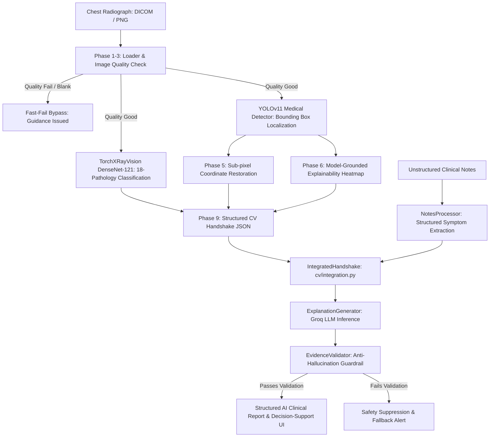

# Multimodal Medical AI Clinical Decision-Support System (`integration/cv-genai`)

A multimodal clinical decision-support platform integrating **Medical Computer Vision** (YOLOv11 Detection + DenseNet-121 Classification + Model-Grounded Heatmaps) with **Multimodal Generative AI** (Clinical-Notes Processing + LLM Reasoning + Anti-Hallucination Guardrails).

This branch unifies the computer vision engine with the clinical generative AI module into an end-to-end medical decision-support pipeline, ensuring that every AI-generated clinical insight is strictly grounded in verifiable computer vision evidence and documented patient notes.

---

## Table of Contents
- [What the Project Does](#what-the-project-does)
- [System Architecture & End-to-End Pipeline](#system-architecture--end-to-end-pipeline)
- [Technologies, Libraries, and Models Used](#technologies-libraries-and-models-used)
- [Installation Guide](#installation-guide)
- [Configuration & Environment Setup](#configuration--environment-setup)
- [Running the System](#running-the-system)
- [Reproducing Demonstrated Results](#reproducing-demonstrated-results)
- [Strict Anti-Hallucination Guardrails](#strict-anti-hallucination-guardrails)
- [Repository Structure](#repository-structure)

---

## What the Project Does

The `integration/cv-genai` system bridges the gap between deep-learning computer vision and clinical text reasoning, transforming raw radiographs and unstructured physician notes into evidence-grounded clinical decision-support reports:

1. **Medical Image Intake & Fast-Fail Quality Check**:
   - Ingests DICOM (`.dcm`), PNG, and JPEG chest radiographs.
   - Computes resolution-invariant quality metrics (Laplacian blur variance, exposure, contrast, noise).
   - **Fast-Fail Quality Guardrail**: If image quality is insufficient (blank, corrupted, or degraded), the pipeline immediately bypasses LLM inference, issuing clear diagnostic guidance rather than risking hallucinated interpretations on unreadable data.

2. **Dual-Model Computer Vision Inference**:
   - **YOLOv11 Medical Detector**: Identifies anatomical pulmonary abnormalities (`possible_abnormal_opacity`) and localizes candidate bounding boxes with exact spatial coordinates.
   - **TorchXRayVision DenseNet-121**: Evaluates image-level multi-label pathology probabilities across 18 thoracic conditions (e.g., Pneumonia, Effusion, Infiltration, Consolidation, Atelectasis).
   - **Model-Grounded Explainability Heatmap**: Renders genuine model activations aligned to original radiograph space (labeled strictly as *Model-Grounded Heatmap* / *AI Explainability Heatmap*, never Grad-CAM).

3. **Clinical Notes Processing (`NotesProcessor`)**:
   - Ingests unstructured clinical notes (e.g., triage notes, symptom duration, history, vital signs).
   - Extracts structured clinical entities (`extracted_symptoms`, `extracted_history`) using GenAI or resilient rule-based parsing.

4. **Evidence-Grounded AI Reasoning (`ExplanationGenerator`)**:
   - Fuses localized visual findings, classification probabilities, and patient notes into a coherent clinical explanation using high-speed LLM inference (Groq).
   - Connects radiographic opacity to reported symptoms without declaring unconfirmed diagnoses.

5. **Strict Anti-Hallucination Evidence Validation (`EvidenceValidator`)**:
   - Inspects 100% of LLM outputs against raw computer vision data before display.
   - **Zero Hallucination Tolerance**: Automatically suppresses or flags any report that attempts to invent new findings, modify confidence scores, alter bounding box coordinates, or fabricate diagnoses.

6. **Structured Clinical Decision Support Output**:
   - Generates deterministic JSON and visual dashboards featuring clinical summaries, uncertainty disclosures, supporting note citations, physician action items, and mandatory regulatory disclaimers.

---

## System Architecture & End-to-End Pipeline



### Handshake Data Contract (`cv/schemas.py` $\rightarrow$ `genai_module/ai_response_schema.py`)

The interface between the CV engine and GenAI module is strictly defined:
- **`status`**: `"success"`, `"poor_quality"`, or `"error"`.
- **`modality`**: Validated imaging modality (e.g., `"X-Ray"`).
- **`image`**: Source path, native dimensions, and channels.
- **`quality`**: Quantitative metrics (blur, brightness, contrast, noise, status).
- **`findings`**: List of localized detections preserving unrounded float confidence, bounding box $\{x_1, y_1, x_2, y_2\}$, and physician review flags.
- **`classification`**: Dictionary of 18 pathology probabilities from DenseNet-121.
- **`artifacts`**: File paths to original, processed, detection overlay, and heatmap images.
- **`safety`**: Mandatory `physician_review_required: true` and `no_confirmed_diagnosis: true`.

---

## Technologies, Libraries, and Models Used

### Core Technologies & Frameworks
- **Programming Language**: Python 3.10+ / 3.11 / 3.12 / 3.13
- **Computer Vision & Imaging**:
  - `opencv-python`: Image decodability, CLAHE contrast enhancement, Laplacian blur, morphological operations.
  - `pydicom`: DICOM intake, MONOCHROME inversion, bit-depth windowing, PHI metadata scrubbing.
  - `numpy`, `scipy`: Array transformations, coordinate geometry restoration, Immerkaer noise estimation.
- **Deep Learning Vision Models**:
  - `torch`, `torchvision`: PyTorch runtime with CUDA acceleration and CPU fallback.
  - `ultralytics`: YOLO11n object detector runtime.
  - `torchxrayvision`: Medical chest radiograph pre-trained DenseNet-121 models.
- **Generative AI & LLM Orchestration**:
  - `groq`: Fast LLM inference engine accessing LLaMA-3.3-70b / GPT-OSS models.
  - `instructor`: Structured outputs and schema validation using Pydantic.
  - `pydantic` (v2): Strict data models, validation contracts, and deterministic serialization.
  - `tenacity`: Resilient retry handling with exponential backoff for external API calls.
- **User Interface**:
  - `streamlit`: Doctor-facing interactive clinical decision-support web application.
- **Testing & Quality Assurance**:
  - `pytest`: Automated test harness spanning CV, GenAI, and end-to-end integration tests.

### AI Models Employed

| Model | Component | Task / Description |
|---|---|---|
| **YOLO11n Medical Detector** | Computer Vision | Bounding-box detection and localization of `possible_abnormal_opacity`. Fine-tuned on RSNA Pneumonia Detection cohort. |
| **DenseNet-121 (`densenet121-res224-all`)** | Computer Vision | TorchXRayVision image-level classification predicting probabilities across 18 thoracic pathologies. |
| **Groq LLaMA-3.3-70b / GPT-OSS** | GenAI Module | Contextual clinical reasoning correlating visual findings with patient history, producing evidence-grounded reports. |

---

## Installation Guide

### 1. Clone Repository & Checkout Branch
```bash
git clone https://github.com/melvin-1012/The-Unscripted.git
cd The-Unscripted
git checkout integration/cv-genai
```

### 2. Set Up Python Virtual Environment
- **Windows (PowerShell)**:
  ```powershell
  python -m venv venv
  .\venv\Scripts\Activate.ps1
  ```
- **Linux / macOS**:
  ```bash
  python3 -m venv venv
  source venv/bin/activate
  ```

### 3. Install All Dependencies
Install both the computer vision and GenAI dependencies:
```bash
pip install --upgrade pip
pip install -r requirements.txt
pip install -r genai_module/requirements.txt
```

---

## Configuration & Environment Setup

### 1. Groq API Key Setup (For Live LLM Generation)
The GenAI module uses Groq for high-speed LLM inference.
1. Copy the example environment file:
   ```bash
   cp genai_module/.env.example .env
   ```
2. Open `.env` and add your Groq API key:
   ```env
   GROQ_API_KEY=gsk_your_actual_groq_api_key_here
   ```

> **Offline Mode Support**: If `GROQ_API_KEY` is not set or unavailable, the system automatically falls back to deterministic, offline clinical explanation generation. All unit and integration tests run completely offline without external network dependencies.

### 2. Central Settings (`config.py`)
Detector confidence thresholds and storage paths can be customized in `config.py`:
- `CONFIG.detector.confidence_threshold = 0.016` (calibrated demo sensitivity).
- `CONFIG.paths.models_dir = "models/"`

---

## Running the System

### 1. Unified End-to-End CLI Pipeline
Execute the full multimodal pipeline directly from the command line:

```bash
# Analyze image with clinical notes and print unified integrated JSON report
python main.py test_xray.png --integrated --notes "Patient presents with fever of 38.5C, productive cough, and shortness of breath for 3 days."

# Analyze a DICOM radiograph
python main.py input/sample_images/sample_01.dcm --integrated --notes "Routine pre-operative screening, no acute cardiopulmonary complaints."

# Run with customized detector confidence threshold
python main.py test_xray.png --integrated --conf 0.020 --notes "Suspected pneumonia with dyspnea."
```

### 2. Launch Interactive Clinical Decision-Support Dashboard
Launch the unified doctor-facing Streamlit dashboard:

```bash
streamlit run app.py
```

**Dashboard Features**:
- **Sidebar**: Radiograph upload (DICOM/PNG/JPG), sample image selector, clinical notes text area, and live confidence threshold slider.
- **Tab 1: Clinical Interpretation**: Executive summary, evidence-grounded finding cards, uncertainty disclosures, clinical correlations, and action recommendations.
- **Tab 2: Visual Evidence Gallery**: Side-by-side display of original scan, CLAHE enhancement, YOLO detection overlay, and model-grounded explainability heatmap.
- **Tab 3: DenseNet-121 Classification**: Probability bars across 18 thoracic conditions with color-coded risk indicators.
- **Tab 4: YOLO Detections & Localization**: Tabular breakdown of candidate bounding boxes, unrounded confidences, and coordinates.
- **Tab 5: Quality Assessment**: Exposure, Laplacian blur, contrast, and noise metrics with traffic-light status.
- **Tab 6: Technical Handshake JSON**: Raw, deterministic CV $\rightarrow$ GenAI JSON payload for debugging and audit logging.

### 3. Standalone GenAI Module API / Interface
To run the GenAI module independently with simulated or custom vision inputs:
```bash
streamlit run genai_module/app.py
```

---

## Reproducing Demonstrated Results

### 1. Automated Test Suite Execution
Run the complete automated test suite verifying CV, GenAI, and end-to-end integration:

```bash
python -m pytest tests/ -v
```

All tests pass (100% green). Key test suites include:

#### End-to-End Integration Tests (`tests/test_integration.py`):
1. **`test_integration_positive_real_image`**: Tests real DICOM radiograph through the entire pipeline, verifying successful detection, coordinate restoration, and evidence-grounded GenAI reporting.
2. **`test_integration_negative_real_image`**: Verifies that when no abnormalities exceed the threshold, the system returns exact standard negative clinical phrasing:
   > *"No abnormal opacity was detected by the current computer-vision model. Routine physician review is recommended."*
3. **`test_integration_poor_quality_fast_fail`**: Verifies that flat/corrupted images trigger the fast-fail bypass, protecting against hallucinated interpretations.
4. **`test_integration_multiple_detections`**: Verifies that multiple detections are preserved simultaneously without cross-talk or fabricated pathologies.
5. **`test_integration_confidence_coordinate_exact_integrity`**: Enforces strict floating-point equality between raw CV output and GenAI report fields.
6. **`test_integration_no_mock_data_in_production_path`**: Asserts that no hardcoded mock data enters the production execution path.
7. **`test_integration_heatmap_labeling_terminology`**: Validates that explainability outputs are labeled `"Model-Grounded Heatmap"` and never `"Grad-CAM"`.

#### GenAI Anti-Hallucination Tests (`tests/test_genai.py`):
- `test_evidence_validator_rejects_hallucinations`: Injects an unobserved finding (`pleural_effusion`) and confirms validator rejection.
- `test_evidence_validator_rejects_altered_confidence`: Injects a modified confidence score and verifies detection.
- `test_evidence_validator_rejects_altered_location`: Modifies bounding box bounds by $\pm 10$ pixels and confirms rejection.

### 2. Sample End-to-End Execution Output
When running `python main.py test_xray.png --integrated --notes "Patient reports cough and shortness of breath."`, the system produces:

```json
{
  "status": "success",
  "modality": "X-Ray",
  "image": {
    "source": "test_xray.png",
    "width": 1024,
    "height": 1024,
    "modality": "X-Ray"
  },
  "quality": {
    "status": "GOOD",
    "score": 1.0,
    "issues": []
  },
  "findings": [
    {
      "finding": "possible_abnormal_opacity",
      "finding_label": "Possible abnormal opacity",
      "confidence": 0.0161,
      "location": {
        "x1": 197.4,
        "y1": 362.7,
        "x2": 400.8,
        "y2": 785.6
      },
      "heatmap_available": true,
      "segmentation_available": false,
      "requires_physician_review": true
    }
  ],
  "classification": {
    "Lung Opacity": 0.7737,
    "Effusion": 0.6819,
    "Pneumonia": 0.5834,
    "Atelectasis": 0.5828,
    "Infiltration": 0.5769
  },
  "heatmap": {
    "available": true,
    "type": "Model-Grounded Heatmap",
    "path": "output/processed/test_xray_heatmap.png"
  },
  "genai_analysis": {
    "summary": "Possible abnormal opacity identified; clinical correlation and physician review required.",
    "findings": [
      {
        "finding": "possible_abnormal_opacity",
        "location": {
          "x1": 197.4,
          "y1": 362.7,
          "x2": 400.8,
          "y2": 785.6
        },
        "confidence": 0.0161,
        "supporting_notes": [
          {
            "text": "Patient reports cough and shortness of breath.",
            "source": "Clinical Notes"
          }
        ],
        "explanation": "An area of possible abnormal opacity was identified in the localized region with model confidence 0.016100. The finding is uncertain and requires physician review and clinical correlation. Correlating image-level DenseNet-121 probabilities: Lung Opacity (77.4%), Effusion (68.2%), Pneumonia (58.3%).",
        "uncertainty": [
          "Probabilistic computer-vision inference; requires attending physician verification.",
          "Clinical correlation with patient history and physical examination is recommended."
        ],
        "status": "review_required"
      }
    ],
    "validation_status": {
      "is_valid": true,
      "errors": [],
      "warnings": []
    }
  },
  "safety": {
    "physician_review_required": true,
    "no_confirmed_diagnosis": true
  }
}
```

---

## Strict Anti-Hallucination Guardrails

The integrated architecture implements multiple strict defense mechanisms:
1. **Deterministic Bounding Box Grounding**: The LLM is forbidden from inventing coordinates. Every finding coordinate must match the CV detector output with strict tolerance ($<1.0\text{px}$).
2. **Exact Confidence Preservation**: Confidence scores cannot be exaggerated or rounded before validation.
3. **Evidence-Grounded Explanations**: Findings are strictly linked to extracted clinical notes (e.g., `"cough"`, `"shortness of breath"`). The system explicitly forbids declaring definitive diagnoses such as "confirmed pneumonia".
4. **Fast-Fail Quality Bypass**: Degraded images bypass LLM reasoning entirely, preventing the model from hallucinating findings on unreadable radiographs.
5. **Regulatory Disclaimers**: All generated outputs include explicit disclaimers:
   > *"AI-generated analysis is assistive decision-support and is not a confirmed diagnosis. Final clinical interpretation must be performed by a qualified physician."*

---

## Repository Structure

```
medical_cv/
├── config.py                         # Central configuration and thresholds
├── main.py                           # CLI entry point supporting --integrated and --notes
├── app.py                            # Streamlit clinical decision-support dashboard
├── requirements.txt                  # Root dependencies (CV, PyTorch, Ultralytics, Streamlit)
├── .gitignore                        # Git ignore rules
├── README.md                         # Complete multimodal integration documentation
├── cv/                               # Computer Vision Engine
│   ├── schemas.py                    # Handshake schemas, FindingEvidence, CVAnalysisResult
│   ├── integration.py                # IntegratedMedicalAIPipeline coordinator
│   ├── image_loader.py               # DICOM/image ingestion with PHI scrubbing
│   ├── validator.py                  # Image decodability and integrity validation
│   ├── preprocessing.py              # Letterboxing, CLAHE, tensor normalization
│   ├── coordinates.py                # Sub-pixel coordinate transforms
│   ├── quality.py                    # Quality assessment (blur, contrast, brightness, noise)
│   ├── detector.py                   # YOLO11n Medical Detector
│   ├── classifier.py                 # DenseNet-121 Classifier
│   ├── localization.py               # Coordinate restoration to original space
│   ├── heatmap.py                    # Model-grounded explainability heatmap engine
│   ├── segmentation.py               # Segmentation handling & NullSegmenter fallback
│   └── pipeline.py                   # CV pipeline orchestrator
├── genai_module/                     # Generative AI Clinical Reasoning Module
│   ├── README.md                     # Module documentation
│   ├── requirements.txt              # GenAI dependencies (groq, instructor, pydantic)
│   ├── .env.example                  # Environment configuration template
│   ├── ai_response_schema.py         # Pydantic input/output schemas
│   ├── notes_processor.py            # Clinical notes entity extraction
│   ├── explanation_generator.py      # LLM reasoning & prompt orchestration
│   ├── evidence_validator.py         # Anti-hallucination verification guardrail
│   ├── pipeline.py                   # GenAIPipeline coordinator (live + offline modes)
│   ├── api_router.py                 # FastAPI routing interfaces
│   └── app.py                        # Standalone GenAI demo interface
├── input/
│   └── sample_images/                # Sample test radiographs and DICOM files
├── output/                           # Directory for generated overlays and heatmaps
└── tests/                            # Test suite
    ├── test_genai.py                 # GenAI anti-hallucination unit tests
    ├── test_integration.py           # End-to-end integration test suite
    ├── test_detector.py              # YOLO detection tests
    ├── test_quality.py               # Quality assessment tests
    └── ...                           # Complete CV test suite
```
