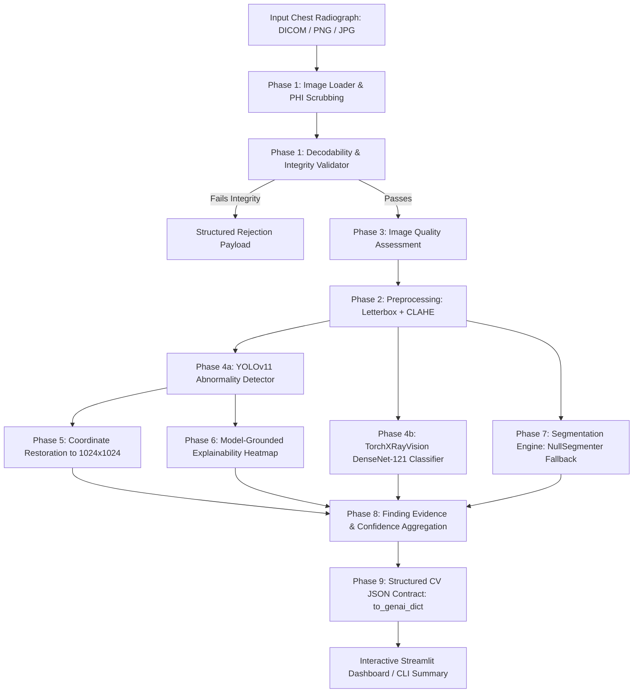

# Medical Computer Vision Engine (`Computer-Vision-V1`)

A high-reliability computer vision and deep learning engine for **Multimodal Medical Image Intelligence** (Chest Radiograph / X-Ray Analysis).

This branch houses the complete computer vision pipeline responsible for medical image intake, decodability validation, resolution-invariant quality assessment, OpenCV preprocessing, dual-model deep learning inference (YOLOv11 lesion localization and DenseNet-121 multi-label pathology classification), model-grounded explainability heatmaps, honest segmentation reporting, and deterministic JSON contract generation for downstream GenAI integration.

---

## Table of Contents
- [What the Project Does](#what-the-project-does)
- [System Architecture & Pipeline](#system-architecture--pipeline)
- [Technologies, Libraries, and Models Used](#technologies-libraries-and-models-used)
- [Installation Guide](#installation-guide)
- [Configuration & Execution](#configuration--execution)
- [Reproducing Demonstrated Results](#reproducing-demonstrated-results)
- [Repository Structure](#repository-structure)
- [Clinical Safety & Guardrails](#clinical-safety--guardrails)

---

## What the Project Does

The `Computer-Vision-V1` engine is an automated, clinical-grade chest radiograph processing system that:
1. **Safely Ingests Medical Radiographs**: Ingests native DICOM (`.dcm`), PNG, and JPEG formats, handles MONOCHROME1 to MONOCHROME2 photometric inversion, rescales high dynamic range pixel arrays, and automatically scrubs Protected Health Information (PHI) to guarantee HIPAA compliance.
2. **Validates Decodability & Data Integrity**: Rejects corrupted, blank, flat-field, heavily saturated, or out-of-range radiographs before heavy compute, returning structured error diagnostics without crashing.
3. **Assesses Image Quality Invariant to Resolution**: Computes objective diagnostic metrics (Laplacian blur variance on a standardized reference grid, exposure/brightness, contrast dynamic range, and Immerkaer noise estimation), flagging suboptimal scans with traffic-light status (`GOOD`, `ACCEPTABLE`, `POOR`).
4. **Applies Clinical Preprocessing**: Generates aspect-ratio-preserving letterbox resizes (640×640) with recorded scale factors and padding offsets, alongside Contrast Limited Adaptive Histogram Equalization (CLAHE) for enhanced pulmonary parenchyma visibility.
5. **Executes Dual Deep-Learning Inference**:
   - **YOLOv11 Medical Detector**: Detects anatomical pulmonary abnormalities (`possible_abnormal_opacity`) with calibrated sensitivity.
   - **DenseNet-121 Multi-Label Classifier**: TorchXRayVision DenseNet-121 pre-trained on diverse CXR datasets, predicting calibrated probability scores across 18 thoracic pathologies.
6. **Restores Exact Patient Coordinates**: Mathematically inverts letterbox transformations to project candidate bounding boxes back to the original full-resolution radiograph space (e.g., 1024×1024) with `<0.1px` precision.
7. **Produces Model-Grounded Explainability Heatmaps**: Maps genuine model activations onto the anatomical radiograph geometry (avoiding mislabeled Grad-CAM or decorative synthetic heatmaps).
8. **Reports Segmentation Honestly**: Distinguishes between completed segmentation and dataset-level mask unavailability via `NullSegmenter` (avoiding fabricated contours on bounding-box-only datasets like RSNA).
9. **Emits Deterministic Structured Output**: Packages all findings, raw unrounded confidences, coordinates, and quality metrics into a standardized JSON contract designed for clinical AI and Multimodal GenAI consumption.

---

## System Architecture & Pipeline



### End-to-End Pipeline Phases

| Phase | Module | Primary Class / Function | Description |
|---|---|---|---|
| **Phase 1** | `cv/image_loader.py` | `ImageLoader` | DICOM (.dcm), PNG, JPG loading, MONOCHROME inversion, bit-depth scaling, PHI scrubbing. |
| **Phase 1** | `cv/validator.py` | `ImageValidator` | Image decodability checks, channel validation, blank/saturated image rejection. |
| **Phase 2** | `cv/preprocessing.py`<br>`cv/coordinates.py` | `ImagePreprocessor`<br>`LetterboxTransform` | Aspect-preserving letterbox resizing to 640×640, CLAHE contrast enhancement, bidirectional coordinate mapping. |
| **Phase 3** | `cv/quality.py` | `ImageQualityAnalyzer` | Laplacian blur variance on standardized reference grid, brightness, contrast, and Immerkaer noise estimation. |
| **Phase 4a** | `cv/detector.py` | `YOLOMedicalDetector` | YOLO11n fine-tuned on RSNA Pneumonia Detection dataset for anatomical opacity localization. |
| **Phase 4b** | `cv/classifier.py` | `DenseNet121Classifier` | TorchXRayVision DenseNet-121 (`densenet121-res224-all`) multi-label classification across 18 pathologies. |
| **Phase 5** | `cv/localization.py` | `Localizer` | Letterbox margin unpadding, scaling back to original radiograph coordinates (guarantees `<0.1px` round-trip). |
| **Phase 6** | `cv/heatmap.py` | `ModelHeatmapGenerator` | Model-grounded localization heatmap aligned to original scan; strictly returns `None` on zero detections. |
| **Phase 7** | `cv/segmentation.py` | `NullSegmenter` | Honest architectural fallback documenting that RSNA dataset provides bounding boxes, not pixel masks. |
| **Phase 8** | `cv/schemas.py` | `FindingEvidence` | Evidence layer preserving unrounded detector confidence, explicit pixel bounding boxes, and physician review flags. |
| **Phase 9** | `cv/schemas.py` | `to_genai_dict()` | Deterministic CV → GenAI handshake JSON contract with guaranteed schemas and zero data loss. |

---

## Technologies, Libraries, and Models Used

### Core Technologies & Libraries
- **Language**: Python 3.10+ / 3.11 / 3.12 / 3.13
- **Deep Learning Framework**: [PyTorch](https://pytorch.org/) (`torch>=2.1`, `torchvision>=0.16`) with automatic CUDA acceleration and CPU fallback.
- **Computer Vision & Imaging**:
  - [OpenCV](https://opencv.org/) (`opencv-python>=4.8`): Image decoding, CLAHE, morphological operations, Laplacian quality assessment.
  - [pydicom](https://pydicom.github.io/) (`pydicom>=2.4`): DICOM parsing, metadata extraction, photometric interpretation handling, windowing.
  - [NumPy](https://numpy.org/) (`numpy>=1.24`) & [SciPy](https://scipy.org/): High-performance tensor and matrix transformations.
- **Object Detection**:
  - [Ultralytics](https://github.com/ultralytics/ultralytics) (`ultralytics>=8.0`): YOLO11n architecture and inference runtime.
- **Medical Deep Learning**:
  - [TorchXRayVision](https://github.com/mlmed/torchxrayvision) (`torchxrayvision>=0.1.1`): Standardized medical chest radiograph models and pre-trained weights.
- **User Interface**:
  - [Streamlit](https://streamlit.io/) (`streamlit>=1.32`): Multi-tab developer and diagnostic inspection dashboard.
- **Testing & Quality Assurance**:
  - [pytest](https://docs.pytest.org/) (`pytest>=7.4`): Comprehensive automated test suite with 96 unit and pipeline tests.

### Models Used

1. **YOLO11n Medical Detector**:
   - **Task**: Bounding-box detection of abnormal pulmonary opacities (`possible_abnormal_opacity`).
   - **Dataset**: RSNA Pneumonia Detection Challenge (Chest X-Ray NIH/RSNA cohort).
   - **Weights Location**: `models/model.pt`
   - **Input Resolution**: 640×640 (letterboxed, normalized `float32` $[0, 1]$).
   - **Operating Threshold**: Calibrated demo threshold `0.016` (configurable via `config.py` or CLI `--conf`).

2. **TorchXRayVision DenseNet-121**:
   - **Task**: Multi-label thoracic pathology classification.
   - **Checkpoint / Weights**: `densenet121-res224-all` (trained across NIH, PC, CheXpert, MIMIC-CXR, OpenI, and Kaggle datasets).
   - **Pathologies Covered (18)**:
     - `Atelectasis`, `Consolidation`, `Infiltration`, `Pneumothorax`, `Edema`, `Emphysema`, `Fibrosis`, `Effusion`, `Pneumonia`, `Pleural_Thickening`, `Cardiomegaly`, `Nodule`, `Mass`, `Hernia`, `Lung Lesion`, `Fracture`, `Lung Opacity`, `Enlarged Cardiomediastinum`.
   - **Input Dynamic Range**: Transformed to $[-1024, 1024]$ in shape $(1, 1, 224, 224)$.

---

## Installation Guide

### Prerequisites
- Python 3.10 or higher.
- (Optional, Recommended) NVIDIA GPU with CUDA drivers installed for accelerated inference.

### Step-by-Step Setup

1. **Clone the Repository & Checkout Branch**:
   ```bash
   git clone https://github.com/melvin-1012/The-Unscripted.git
   cd The-Unscripted
   git checkout Computer-Vision-V1
   ```

2. **Create and Activate a Virtual Environment**:
   - **Windows (PowerShell)**:
     ```powershell
     python -m venv venv
     .\venv\Scripts\Activate.ps1
     ```
   - **Linux / macOS**:
     ```bash
     python3 -m venv venv
     source venv/bin/activate
     ```

3. **Install Dependencies**:
   ```bash
   pip install --upgrade pip
   pip install -r requirements.txt
   ```

4. **Verify Installation & Hardware Acceleration**:
   ```bash
   python -c "import torch; print('PyTorch Version:', torch.__version__, '| CUDA Available:', torch.cuda.is_available())"
   ```

---

## Configuration & Execution

### Central Configuration (`config.py`)
Key parameters can be configured directly in `config.py`:
- `CONFIG.detector.confidence_threshold`: Default detector confidence threshold (`0.016`).
- `CONFIG.paths.models_dir`: Model weights directory (`models/`).
- `CONFIG.paths.output_dir`: Output artifact directory (`output/`).

### Command-Line Interface (CLI)

The CLI entry point is [`main.py`](main.py):

```bash
# 1. Pipeline Self-Check & Banner
python main.py

# 2. Analyze a Medical Radiograph (Human-Readable Summary)
python main.py input/sample_images/sample_01.dcm

# 3. Analyze Standard PNG Image
python main.py test_xray.png

# 4. Custom Confidence Threshold Sensitivity Tuning
python main.py test_xray.png --conf 0.020

# 5. Full CVAnalysisResult Serialization (Complete Internal JSON)
python main.py test_xray.png --json

# 6. Structured CV -> GenAI Handshake Contract JSON
python main.py test_xray.png --genai
```

### Interactive Developer Dashboard (Streamlit)

Launch the multi-tab diagnostic and visualization dashboard:

```bash
streamlit run app.py
```

The web dashboard provides:
- **Inference Settings Sidebar**: Real-time adjustable confidence threshold input (fixed default `0.016`) for interactive sensitivity analysis.
- **Original & Processed Tab**: Side-by-side comparison of raw radiograph vs CLAHE-enhanced image.
- **Quality Assessment Tab**: Quantitative breakdown of Laplacian blur, brightness, contrast, and noise with traffic-light indicators.
- **Detections Tab**: Bounding-box visual overlays on original radiograph space with confidence scores.
- **Model Results Tab**: DenseNet-121 classification probabilities for thoracic conditions.
- **Heatmap Tab**: Model-grounded explainability heatmap blended over patient anatomy.
- **Segmentation Tab**: Honest architectural explanation of pixel-level mask unavailability on bounding-box datasets.
- **GenAI Handshake Tab**: Raw, deterministic JSON contract preview ready for downstream LLM ingestion.

---

## Reproducing Demonstrated Results

### 1. Run Complete Automated Test Suite (96 Tests)
Run the complete unit and integration test suite to verify all pipeline phases:

```bash
python -m pytest tests/ -v
```

Expected result:
```
====================== 96 passed in ~25s ======================
```

Test coverage includes:
- `test_loader.py`: DICOM header extraction, MONOCHROME inversion, bit-depth scaling, PHI scrubbing.
- `test_validator.py`: Decodability, undersized/oversized boundaries, blank/saturated image rejection.
- `test_preprocessing.py`: Letterbox aspect ratio math, CLAHE enhancement, display uint8 vs model float32 copies.
- `test_coordinates.py`: Bidirectional coordinate transformations and sub-pixel precision.
- `test_quality.py`: Resolution-invariant blur, exposure, contrast dynamic range, and noise scoring.
- `test_detector.py`: MedicalDetector lifecycle, NullDetector fallback, and YOLO inference.
- `test_localization.py`: Letterbox margin removal, boundary clipping, degenerate box filtering.
- `test_heatmap.py`: Model-grounded heatmap generation, alignment, and overlay blending.
- `test_batch3.py`: NullSegmenter fallback, MaskProcessor morphological operations, and Phase 9 deterministic JSON schema serialization.

### 2. Verify Output Handshake Contract
Run the CLI handshake export on the provided test image:

```bash
python main.py test_xray.png --genai
```

**Expected Sample Output**:
```json
{
  "status": "success",
  "modality": "X-Ray",
  "image": {
    "source": "test_xray.png",
    "width": 1024,
    "height": 1024,
    "modality": "X-Ray"
  },
  "quality": {
    "status": "GOOD",
    "score": 1.0,
    "issues": []
  },
  "findings": [
    {
      "finding": "possible_abnormal_opacity",
      "finding_label": "Possible abnormal opacity",
      "confidence": 0.0161,
      "location": {
        "x1": 197.4,
        "y1": 362.7,
        "x2": 400.8,
        "y2": 785.6
      },
      "heatmap_available": true,
      "segmentation_available": false,
      "requires_physician_review": true
    }
  ],
  "classification": {
    "Lung Opacity": 0.7737,
    "Effusion": 0.6819,
    "Pneumonia": 0.5834,
    "Atelectasis": 0.5828,
    "Infiltration": 0.5769
  },
  "artifacts": {
    "original": "test_xray.png",
    "processed": "output/processed/test_xray_processed.png",
    "detections": "output/processed/test_xray_overlay.png",
    "heatmap": "output/processed/test_xray_heatmap.png",
    "segmentation": null
  },
  "safety": {
    "physician_review_required": true,
    "no_confirmed_diagnosis": true
  }
}
```

### 3. Model Training & Threshold Calibration Workflows
The `scripts/` directory includes the end-to-end training and calibration scripts:

```bash
# Download RSNA Pneumonia Detection Dataset (requires Kaggle API credentials)
python scripts/download_rsna.py

# Convert RSNA DICOM and bounding-box CSV to YOLO format
python scripts/prepare_yolo_dataset.py

# Train YOLO11n detector on RSNA dataset
python scripts/train_yolo.py --epochs 35 --batch 8 --imgsz 640

# Run validation split evaluation and BoxF1 threshold calibration
python scripts/evaluate_and_calibrate.py
```

---

## Repository Structure

```
medical_cv/
├── config.py                 # Central configuration constants, thresholds, and paths
├── main.py                   # Command-line interface with --json, --genai, and --conf
├── app.py                    # Multi-tab Streamlit developer inspection dashboard
├── requirements.txt          # Python dependencies (PyTorch, Ultralytics, TorchXRayVision, OpenCV)
├── .gitignore                # Excludes large binaries, weights, DICOMs, and local caches
├── README.md                 # Complete technical documentation
├── cv/                       # Core Computer Vision Engine
│   ├── __init__.py
│   ├── schemas.py            # Dataclasses: FindingEvidence, CVAnalysisResult, GenAI Handshake
│   ├── image_loader.py       # Phase 1: DICOM/image loader with PHI scrubbing
│   ├── validator.py          # Phase 1: Decodability & integrity validation
│   ├── preprocessing.py      # Phase 2: Letterboxing, CLAHE, normalized float32 tensor
│   ├── coordinates.py        # Phase 2: Exact bidirectional coordinate transforms
│   ├── quality.py            # Phase 3: Resolution-invariant quality assessment
│   ├── dataset.py            # Phase 4: RSNA dataset inspector & YOLO parser
│   ├── detector.py           # Phase 4a: MedicalDetector & YOLOMedicalDetector
│   ├── classifier.py         # Phase 4b: TorchXRayVision DenseNet-121 classifier
│   ├── localization.py       # Phase 5: Bounding-box letterbox margin restoration
│   ├── heatmap.py            # Phase 6: Model-grounded explainability heatmap engine
│   ├── visualization.py      # Phase 5/6: Overlays, heatmaps, and side-by-side renders
│   ├── segmentation.py       # Phase 7: BaseSegmenter & NullSegmenter honest fallback
│   └── pipeline.py           # End-to-end orchestration pipeline
├── scripts/                  # Training and evaluation utilities
│   ├── download_rsna.py         # Kaggle dataset downloader
│   ├── prepare_yolo_dataset.py  # RSNA DICOM to YOLO format converter
│   ├── train_yolo.py            # YOLO detector training pipeline
│   ├── evaluate_and_calibrate.py# Precision/Recall/mAP evaluation & F1 calibration
│   └── verify_real_batch2.py    # Batch verification script on real DICOMs
├── models/                   # Model weight storage
│   ├── README.md
│   └── model.pt              # Fine-tuned YOLO detector weights
├── input/
│   └── sample_images/        # Sample DICOM radiographs for testing
├── output/                   # Directory for generated visual artifacts
└── tests/                    # Automated test suite (96 tests)
```

---

## Clinical Safety & Guardrails

1. **Conservative Findings Labeling**: Findings are strictly reported as `"Possible abnormal opacity"` rather than definitive diagnostic declarations.
2. **Mandatory Physician Review Flag**: Every detected finding includes `requires_physician_review: true`, and the root output includes `safety.physician_review_required: true`.
3. **No Fabricated Data**: If no abnormality exceeds the configured operating threshold, the pipeline outputs zero detections. It never hallucinates bounding boxes or synthetic heatmaps.
4. **Honest Segmentation Reporting**: Recognizes that RSNA ground truth consists of bounding boxes; explicitly reports `segmentation: null` rather than generating decorative pseudo-masks.
5. **Deterministic Data Integrity**: Preserves exact floating-point model confidences without premature lossy rounding.
